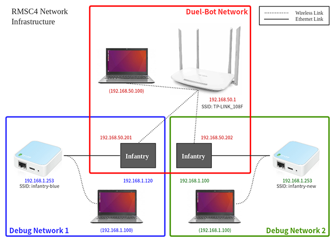

# 2018 RoboMaster SummerCamp (Team 4)
The code is developed based on the official RoboRTS package.

## Overview
(TODO)

## Dependency
(TODO)

## Usage
(TODO)

## Checklist
 - 爪子............................零位
 - 气阀............................开启
 - 摩擦轮........................吐2个弹
 - 头盖骨........................合上且不阻碍云台
 - 启动位置....................正常
 - 后视摄像机................重新插拔
 - 颜色检测....................配置为敌方颜色
 - 装甲板检测................配置为敌方颜色
 - 障碍块扫描................配置为我方启动区

## Network Infrastructure
