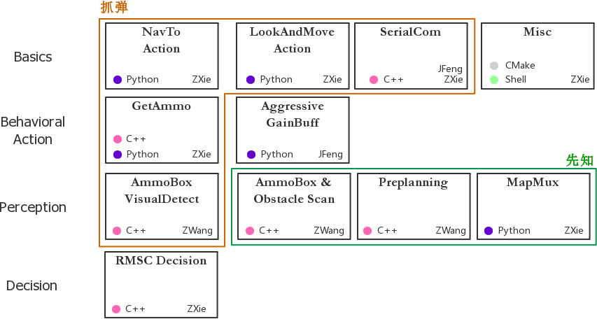

# 2018 RoboMaster SummerCamp (Team 4)
The code is developed based on the official RoboRTS package.

## Overview

The nodes (modules) we implemented can be categorized in to GRASP(抓弹) and SEER(先知).

## Dependency
 - Ubuntu 16.04
 - ROS Kinetic
 - ...(TODO)
 
## Usage
(TODO)

## Network Infrastructure

## Checklist
 - 爪子............................零位
 - 气阀............................开启
 - 摩擦轮........................吐2个弹
 - 头盖骨........................合上且不阻碍云台
 - 启动位置....................正常
 - 后视摄像机................重新插拔
 - 颜色检测....................配置为敌方颜色
 - 装甲板检测................配置为敌方颜色
 - Seer结点................配置为我方启动区
 - WingBot.................启动位置复位
 - MasterBot...............启动位置
 (TODO)